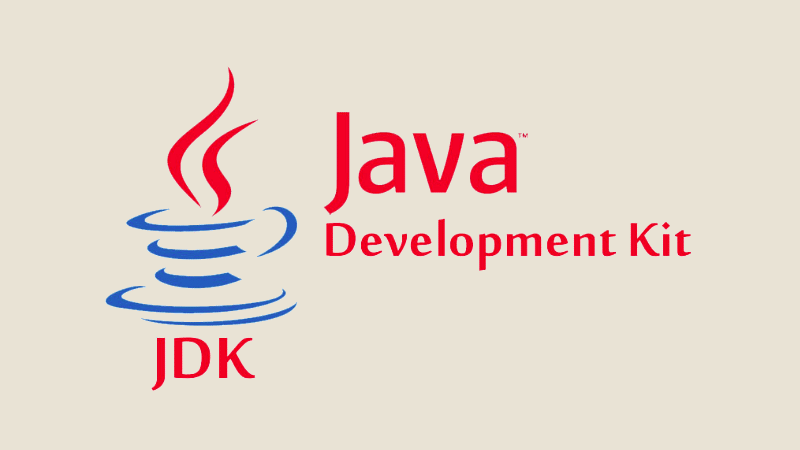

# Question

- Donnez les définitions des termes suivants :

- JVM
- JRE
- JDK
- IDE
- Android Gradle
- Android API Levels

# Configurer android studio

## jdk defenition

- Jdk is a java Development kit is a software development kit used by developers to create Java applications. It contains tools and libraries necessary for developing Java applications, including
    JRE (Java Runtime Environment): The JDK includes the JRE, which is necessary for running Java applications.

- Compiler: The JDK includes the Java compiler (javac), which translates Java source code into bytecode that can be executed by the JVM.

- Debugger: It provides debugging tools for identifying and fixing errors in Java programs.

- Libraries: The JDK includes a set of libraries (such as the Java Standard Edition API) that provide functionality for common tasks, such as input/output operations, networking, and data manipulation.

- Documentation: It includes documentation for the Java language and libraries, which is helpful for developers to understand how to use various features and classes.

- if you're creating a Kotlin application, you will still need to download and install the JDK (Java Development Kit) on your system. This is because Kotlin, like Java, runs on the Java Virtual Machine (JVM), and Kotlin code gets compiled into Java bytecode, which the JVM can execute.